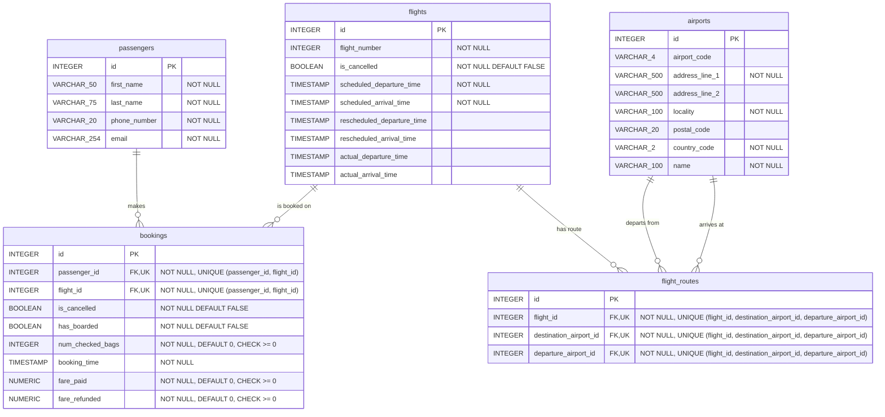

# ex603-airline-bookings-database

## Name
Shane Nycum

## Summary
Flight booking system for an airline to manage customer bookings

## Domain
This system is a PostgreSQL database for manageing flight bookings for an airline. The system is designed for a single airline - NOT an airport servicing multiple airlines.

It allows customers or airline staff to book flights and query information related to the customer bookings and flight statuses. It can answer questions related to:

1. Passenger booking (i.e. which customers have booked a given flight?)

2. Flight schedule adherence (i.e. what is the time difference between the scheduled arrival time and actual arrival time?)

3. Revenue (i.e. how much revenue did a given flight generate?)

4. Flight routes (i.e. which airports have the most flight activity?)

## Entity Relationship Diagram

## Schema

- **`passengers`** - One row per customer. Independent entity; referenced by `bookings`.
- **`flights`** - One row per flight. Tracks scheduled, rescheduled, and actual departure/arrival times. Independent entity; referenced by `bookings` and `flight_routes`.
- **`airports`** - One row per airport, with location and indentifying information (such as airport code). Independent entity; referenced twice by `flight_routes` (once as departure, once as destination).
- **`bookings`** - Junction table resolving the many-to-many relationship between `passengers` and `flights`, plus booking-specific facts (cancellation, boarding, bag count, fare paid/refunded).
- **`flight_routes`** - Junction table resolving the many-to-many relationship between `flights` and `airports`, recording each flight's departure and destination airport.

### Design decisions:

- **Surrogate keys.** All five tables use surrogate primary keys. `passengers`, `flights`, and `airports` need them because their natural key candidates (names, flight numbers, airport codes) are either mutable or not guaranteed unique. `bookings` and `flight_routes` would be good candidates to use a natural key for the sake of this project, since they are not referenced by any other tables. However, I opted to use a surrogate primary key in order to try and replicate the best decision for a real-life system. In the real world, these tables would be likely to be referenced or queried in many different places.
- **`ON DELETE NO ACTION`** everywhere. Every foreign key in the schema uses `NO ACTION` rather than `CASCADE`. `bookings` and `flight_routes` rows are historical/financial records that must not disappear just because a passenger, flight, or airport row is later deleted. 
- **`NUMERIC(10,2)` for money.** `fare_paid` and `fare_refunded` use `NUMERIC` rather than floating point, to avoid rounding errors accumulating across financial calculations.
- **CHECK constraints on non-negative values.** `num_checked_bags`, `fare_paid`, and `fare_refunded` all have `CHECK (... >= 0)` constraints, since negative values in any of these columns describe no real-world state.