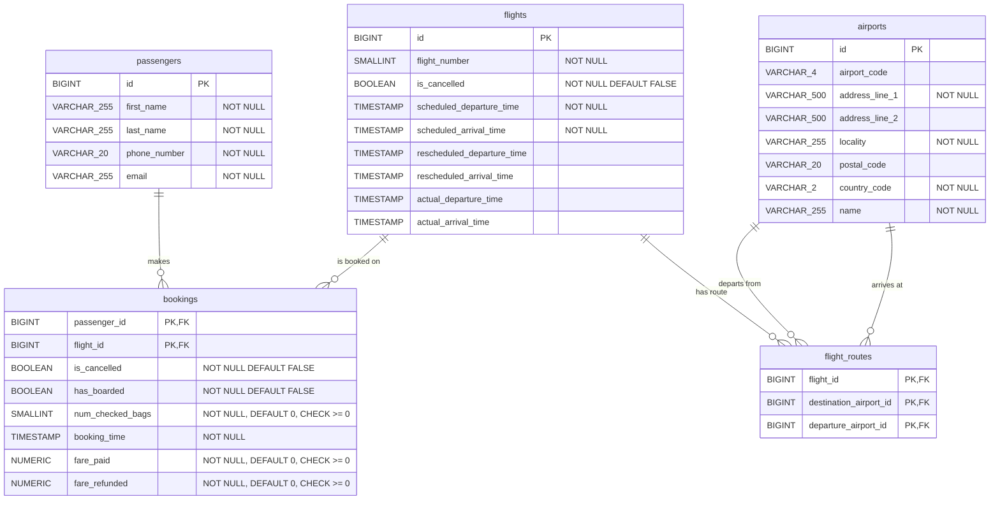

```mermaid
erDiagram
    passengers {
        BIGINT id PK
        VARCHAR_255 first_name "NOT NULL"
        VARCHAR_255 last_name "NOT NULL"
        VARCHAR_20 phone_number "NOT NULL"
        VARCHAR_255 email "NOT NULL"
    }

    flights {
        BIGINT id PK
        SMALLINT flight_number "NOT NULL"
        BOOLEAN is_cancelled "NOT NULL DEFAULT FALSE"
        TIMESTAMP scheduled_departure_time "NOT NULL"
        TIMESTAMP scheduled_arrival_time "NOT NULL"
        TIMESTAMP rescheduled_departure_time
        TIMESTAMP rescheduled_arrival_time
        TIMESTAMP actual_departure_time
        TIMESTAMP actual_arrival_time
    }

    bookings {
        BIGINT passenger_id PK, FK
        BIGINT flight_id PK, FK
        BOOLEAN is_cancelled "NOT NULL DEFAULT FALSE"
        BOOLEAN has_boarded "NOT NULL DEFAULT FALSE"
        SMALLINT num_checked_bags "NOT NULL, DEFAULT 0, CHECK >= 0"
        TIMESTAMP booking_time "NOT NULL"
        NUMERIC fare_paid "NOT NULL, DEFAULT 0, CHECK >= 0"
        NUMERIC fare_refunded "NOT NULL, DEFAULT 0, CHECK >= 0"
    }

    airports {
        BIGINT id PK
        VARCHAR_4 airport_code
        VARCHAR_500 address_line_1 "NOT NULL"
        VARCHAR_500 address_line_2
        VARCHAR_255 locality "NOT NULL"
        VARCHAR_20 postal_code
        VARCHAR_2 country_code "NOT NULL"
        VARCHAR_255 name "NOT NULL"
    }

    flight_routes {
        BIGINT flight_id PK, FK
        BIGINT destination_airport_id PK, FK
        BIGINT departure_airport_id PK, FK
    }

    passengers ||--o{ bookings : "makes"
    flights ||--o{ bookings : "is booked on"
    flights ||--o{ flight_routes : "has route"
    airports ||--o{ flight_routes : "departs from"
    airports ||--o{ flight_routes : "arrives at"
```